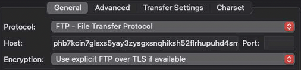

# onion-honeypot


[](https://www.elastic.co/blog/category/releases)


A series of low interaction honeypot decoy programs (HTTP, FTP, and Telnet) to lure potential attackers using Tor Hidden Service (Onions) with ELK stack for data logging and visualising.

## Contents

- [1 Project architecture](#1-project-architecture)
- [2 Features](#2-features)
- [3 Prerequisites](#3-prerequisites)
    - [3.1 Docker](#31-docker)
    - [3.2 Docker Compose](#32-docker-compose)
    - [3.3 Port availability](#33-port-availability)
- [4 Usage](#4-usage)
    - [4.1 General usage](#4.1-general-usage)
    - 4.2 Accessing, interacting, and testing the honeypots
        - [4.2.1 Via the local host machine](#421-via-the-local-host-machine)
            - [4.2.1.1 HTTP honeypot](#4211-http-honeypot)
            - [4.2.1.2 FTP honeypot](#4212-ftp-honeypot)
            - [4.2.1.3 Telnet honeypot](#4213-telnet-honeypot)
        - 4.2.2 Via `.onion` hidden service sites
            - [4.2.2.1 HTTP honeypot](#4221-http-honeypot)
            - [4.2.2.2 FTP honeypot](#4222-ftp-honeypot)
            - [4.2.2.3 Telnet honeypot](#4223-telnet-honeypot)
- 5 TO-DOs
- [6 Contributing](#6-contributing)
- [7 License](#7-license)
- [8 Acknowledgments](#8-acknowledgments)

## 1 Project architecture

1. **Host machine**: The underlying hardware (i.e. your machine) that will run the Docker Engine.
2. **Docker Engine**: The container orchestration platform that manages and runs containers.
3. **HTTP honeypot**: A Docker container running the HTTP honeypot application.
4. **FTP honeypot**: A Docker container running the FTP honeypot application.
5. **Telnet honeypot**: A Docker container running the Telnet honeypot application.
6. **Logstash**: A Docker container that recieves logs from the honeypot, parses or enriches them for further processing, and sends it to Elasticsearch.
7. **Elasticsearch**: A Docker container that stores the processed logs from Logstash in a searchable format.
8. **Kibana**: A Docker container that provides the web interface for visualising and analysing logs stored in Elasticsearch.

([back to top](#contents))

## 2 Features

- The honeypot are accessible on Tor (or dark web) as a hidden service, luring attackers.
- All honeypot applications leverage lightweight, powerful, reliable, and scalable Python libraries.
- ELK stack for a versatile and secure way of accessing honeypot data.
- Powerful logging and data visualising capabilities through Kibana.
- Fully containerised setup, cross platform compatability – no external packages or dependencies required (other than Docker and Docker Compose).
- Secure and easily managable, since each service is isolated in its own Docker container

> [!WARNING]
> Currently, any security features of the ELK stack are temporarily disabled to facilitate the development of the ELK stack. These will be re-enabled in the future.

([back to top](#contents))

## 3 Prerequisites

### 3.1 Docker

Ensure the Docker engine is installed on your system with version **18.06.0** or higher.

You can download and install the Docker engine from the [official Docker website](https://www.docker.com/get-started/).

> [!NOTE]
> - Especially on Linux, make sure your user has the [required permissions](https://docs.docker.com/engine/install/linux-postinstall/) to interact with the Docker daemon.
> - If you are unable to do this, either append `sudo` in front of each `docker` command or switch to root using `sudo -s`.

([back to top](#contents))

### 3.2 Docker Compose

Ensure that Docker Compose is installed on your system with **version 1.28.0** or higher. 

You can download and install Docker Compose from the [official Docker website](https://docs.docker.com/compose/install/).

([back to top](#contents))

### 3.3 Port availability

The services running on each Docker Container use the following ports. Ensure that these ports are free and are not running any conflicting services or have firewall rules concerning them.

- **Tor**:
    - 9050 (for SOCKS)
- **HTTP honeypot**:
    - 5000 (for Python Flask application)
- **FTP honeypot**:
    - 21 (default for FTP)
- **Telnet honeypot**:
    - 23 (default for Telnet)
- **Elasticsearch**:
    - 9200 (for HTTP)
    - 9300 (for TCP transport)
- **Logstash**:
    - 5044 (for Beats input) – currently not using Beats at the moment
    - 5514 (for HTTP input)
    - 9600 (for API monitoring endpoint)
- **Kibana**:
    - 5601 (for web UI console)

([back to top](#contents))

## 4 Usage

([back to top](#contents))

### 4.1 General usage

1. Clone the repository to your local machine.

```bash
git clone https://github.com/iArcanic/onion-honeypot
```

2. Navigate to the project's directory.

```bash
cd onion-honeypot
```

3. Build and run all Docker containers.

```bash
docker-compose up
```

> [!NOTE]
> With Docker Compose, you can also optionally use the following:
> - If you want to build the images each time (or changed a Dockerfile), use `docker-compose --build`.
> - If you want to run all the services in the background, use `docker-compose -d`.
> After, you can optionally view Docker images, status of containers, and interact with running containers using the Docker Desktop application:
> 

4. Access the Kibana web UI console at [http://localhost:5601](http://localhost:5601).

> [!NOTE]
> - You may need to give some time (a couple of minutes depending upon your network speed and hardware capabilities) for all containers to run and initialise.
> - If you are running for the first time or using the `--build` flag, expect it to take some time.

5. Once some data is collected in any of the honeypot applications, open the "Discover" tab in the "Analytics" section at [http://localhost:5601/app/discover#](http://localhost:5601/app/discover#).

6. Click on the blue box "Create data view", fill in the required text fields and save the view to Kibana.


Unless you want a customised timestamp according to your needs, leave it at the default value of `@timestamp`.

> [!NOTE]
> The "Index pattern" text field should be a pattern that matches the log source. In this case, the log source is called "honeypot-logs", so an index pattern like `honey*` or `h*` is accepted. For more information on this, click the book icon next to this text field:
> 

7. You should now see the console view with logged data.


All logged data is displayed in the "Documents" tab below the bar chart.

Use the left hand pane to filter the data based on the selected fields. Here for example, the `honeypot` field as selected, which can filter the logged documents based on the type of honeypot application (HTTP, FTP, or Telnet).


> [!WARNING]
> After running the honeypots for a long period of time and you don't see any data on the Kibana console at all, expand the time range.
> 

> [!NOTE]
> For more information on how to effectively use Kibana as well as other powerful features it has, refer to their official documentation [here](https://www.elastic.co/guide/en/kibana/8.13/index.html).

([back to top](#contents))

### 4.2 Accessing, interacting, and testing the honeypots

Attackers may have several specialised methods and tactics to scan the Tor network for hidden services that host specific protocols. It is important for you to test them so that you have confidence in the functionality of the honeypots, their effectiveness, any false positive scenarios, and whether they may comprise your existing network infrastructure.

> [!WARNING]
> To interact and test with a specific honeypot, ensure that the respective Docker container is up and running on your local machine.
> Verify this by running `docker ps -a` and identify the name of the honeypot (starts with the prefix `onion-honeypot-...`) and its status.
> Alternatively, you could use the Docker Desktop application to see the status of the Docker container quicker:
> 

([back to top](#contents))

#### 4.2.1 Via the local host machine

For speed and ease of access, you can open and interact with all the honeypots locally.

([back to top](#contents))

##### 4.2.1.1 HTTP honeypot

1. Open a web browser on your local machine.

2. Visit the HTTP honeypot.

In the address bar of your web browser, enter the URL of the HTTP honeypot.

```bash
http://localhost:5000
```


> [!NOTE]
> Optionally, for quicker access, you could also use `curl` or `wget` in your command line.

3. Login using valid credentials.

Valid credentials can be found in [`mock-data/user_credentials`](https://github.com/iArcanic/onion-honeypot/blob/main/mock-data/user_credentials.json)).

Upon successful login, you will be redirected to a page like so:


> [!NOTE]
> For quicker and more efficient testing, add valid credentials (from [`mock-data/user_credentials`](https://github.com/iArcanic/onion-honeypot/blob/main/mock-data/user_credentials.json)) by default to the login fields in [`http-honeypot/src/templates/login.html`](https://github.com/iArcanic/onion-honeypot/blob/main/http-honeypot/src/templates/login.html) by giving the `value` attribute to the `<input>` tags, for example:
> ```bash
> <input type="text" id="username" name="username" value="admin" required>
> <input type="password" id="password" name="password" value="password123" required>
> ```

4. Interact with the honeypot.

From the directory listing, you can view the contents of folders and download files.


5. See logged activities in Kibana console ([http://localhost:5601](http://localhost:5601)).

6. Optionally, you can also verify honeypot activities from the container's logs.

List all available containers and find the ID of the HTTP honeypot container.

```bash
docker ps -a
```

View the container's logs.

```bash
docker logs <HTTP_HONEYPOT_CONTAINER_ID>
```

You should see something similar to this:

```bash
http-honeypot-1    | 192.168.65.1 - - [11/Apr/2024 10:07:54] "GET /admin/Music/cool-soundtrack.mp3 HTTP 1.1" 200 -
http-honeypot-1    | Log sent to Logstash successfully!
http-honeypot-1    | 192.168.65.1 - - [11/Apr/2024 10:08:08] "GET /admin/ HTTP/1.1" 302 -
http-honeypot-1    | 192.168.65.1 - - [11/Apr/2024 10:08:08] "GET /admin HTTP/1.1" 200 -
```

([back to top](#contents))

##### 4.2.1.2 FTP honeypot

1. Install the FTP command line client.

macOS:

- Install Homebrew (if not already installed).

```bash
/bin/bash -c "$(curl -fsSL https://raw.githubusercontent.com/Homebrew/install/HEAD/install.sh)"
```

> [!NOTE]
> Visit Homebrew's official website [here](https://brew.sh) for more information.
> You will require administrative priviledges during the installation process.

- Install the `inetutils` package.

```bash
brew install inetutils
```

> [!NOTE]
> Visit GNU's official website [here](https://www.gnu.org/software/inetutils/) for more information on `inetutils`.

Windows:

- The `ftp` client on command line is installed by default.

Linux:

- Debian/Ubuntu:

```bash
sudo apt update
sudo apt install ftp
```

- CentOS/RHEL:

```bash
sudo yum check-update
sudo yum install ftp
```

- Fedora:

```bash
sudo dnf check-update
sudo dnf install ftp
```

- Arch:

```bash
sudo pacman -Sy
sudo pacman -S ftp
```

> [!NOTE]
> You could also use a GUI client suitable for your system, such as [Filezilla](https://filezilla-project.org).

2. Login to FTP honeypot.

Specify a valid username.

```bash
ftp <VALID_USERNAME>@localhost
```

> [!NOTE]
> For valid credentials, please see [`mock-data/user_credentials.json`](https://github.com/iArcanic/onion-honeypot/blob/main/mock-data/user_credentials.json).


You will see the below, with a prompt to enter your password.

```bash
Connected to localhost.
220 Welcome to the FTP server
331 Username ok, send password.
Password: 
230 Login successful.
ftp> 
```

3. Interact with the FTP honeypot.

To see all available commands, type `?`.

```bash
ftp> ?
Commands may be abbreviated.  Commands are:

!       dir         macdef      proxy       site
$       disconnect  mdelete     sendport    size
account epsv4       mdir        put         status
append  form        mget        pwd         struct
ascii   get         mkdir       quit        system
bell    glob        mls         quote       sunique
binary  hash        mode        recv        tenex
bye     help        modtime     reget       trace
case    idle        mput        rstatus     type
cd      image       newer       rhelp       user
cdup    ipany       nmap        rename      umask
chmod   ipv4        nlist       reset       verbose
close   ipv6        ntrans      restart     ?
cr      lcd         open        rmdir
delete  lpwd        passive     runique
debug   ls          prompt      send
ftp> 
```

> [!WARNING]
> All commands work except for directory listing commands (such as `ls`) as of now.

4. See logged activities in Kibana console ([http://localhost:5601](http://localhost:5601)).

> [!WARNING]
> Only login attempts are recorded and logged currently.

5. Optionally, you can also verify honeypot activities from the container's logs.

List all available containers and find the ID of the FTP honeypot container.

```bash
docker ps -a
```

View the container's logs.

```bash
docker logs <FTP_HONEYPOT_CONTAINER_ID>
```

You should see something similar to this:

```bash
ftp-honeypot-1     | [I 2024-04-11 11:00:01] 192.168.65.1:61629-[admin] FTP session closed (disconnect).
ftp-honeypot-1     | [I 2024-04-11 11:01:49] 192.168.65.1:62346-[] FTP session opened (connect)
ftp-honeypot-1     | [I 2024-04-11 11:01:52] 192.168.65.1:62346-[] FTP session closed (disconnect).
ftp-honeypot-1     | [I 2024-04-11 11:01:55] 192.168.65.1:62369-[] FTP session opened (connect)
ftp-honeypot-1     | [I 2024-04-11 11:02:05] 192.168.65.1:62369-[admin] USER 'admin' logged in.
ftp-honeypot-1     | Log sent to Logstash successfully!
```

([back to top](#contents))

##### 4.2.1.3 Telnet honeypot

1. Install the Telnet command line client.

macOS:

- Install Homebrew (if not already installed).

```bash
/bin/bash -c "$(curl -fsSL https://raw.githubusercontent.com/Homebrew/install/HEAD/install.sh)"
```

> [!NOTE]
> Visit Homebrew's official website [here](https://brew.sh) for more information.
> You will require administrative priviledges during the installation process.

- Install the `inetutils` package.

```bash
brew install inetutils
```

Windows:

- Press `Win + X`.
- Select "Windows PowerShell (Admin)"
- Run the following command to enable the Telnet client:

```bash
Enable-WindowsOptionalFeature -FeatureName TelnetClient -Online
```

Linux:

- Debian/Ubuntu:

```bash
sudo apt update
sudo apt install telnet
```

- CentOS/RHEL:

```bash
sudo yum check-update
sudo yum install telnet
```

- Fedora:

```bash
sudo dnf check-update
sudo dnf install telnet
```

- Arch:

```bash
sudo pacman -Sy
sudo pacman -S telnet
```

2. Access the Telnet honeypot.

```bash
telnet localhost
```

If successful, you will see something similar to this and be prompted to enter a login:

```bash
Trying ::1...
Connected to localhost.
Escape character is '^]'.

ApacheServer login:
```

3. Login to the Telnet honeypot.

```bash
ApacheServer login: admin
Password: password123
```

> [!NOTE]
> For valid credentials, please see [`mock-data/user_credentials.json`](https://github.com/iArcanic/onion-honeypot/blob/main/mock-data/user_credentials.json).

> [!WARNING]
> Password blurring has not yet been implemented.

On successful login, you should see the following:

```bash
--------------------------------
Welcome to Apache Linux 2.4.43!
Type 'help' for a list of commands.

admin@ApacheServer:~$ 
```

4. Interact with the Telnet honeypot.

```bash
admin@ApacheServer:~$ pwd
/admin
admin@ApacheServer:~$ echo hello
hello
admin@ApacheServer:~$ quit
Connection closed by foreign host.
```

> [!NOTE]
> Currently, only `pwd`, `echo`, `exit`, and `quit` commands work.

5. See logged activities in Kibana console ([http://localhost:5601](http://localhost:5601)).

> [!NOTE]
> Only login attempts are recorded and logged currently.

6. Optionally, you can also verify honeypot activities from the container's logs.

List all available containers and find the ID of the FTP honeypot container.

```bash
docker ps -a
```

View the container's logs.

```bash
docker logs <TELNET_HONEYPOT_CONTAINER_ID>
```

You should see something similar to this:

```bash
telnet-honeypot-1  | Accepted connection from ('192.168.65.1', 39836)
telnet-honeypot-1  | Log sent to Logstash successfully!
```

([back to top](#contents))

#### 4.2.2 Via `.onion` hidden service sites

The general procedure to get the `.onion` site URLs for each honeypot application:

1. List all available containers and find the ID of the Tor container.

```bash
docker ps -a
```

2. Using that, display the contents of the `hostname` file for each honeypot application.

HTTP honeypot:

```bash
docker exec -ti <HTTP_HONEYPOT_CONTAINER_ID> cat /var/lib/tor/http_honeypot_hidden_service/hostname
```

FTP honeypot:

```bash
docker exec -ti <FTP_HONEYPOT_CONTAINER_ID> cat /var/lib/tor/ftp_honeypot_hidden_service/hostname
```

Telnet honeypot:

```bash
docker exec -ti <TELNET_HONEYPOT_CONTAINER_ID> cat /var/lib/tor/telnet_honeypot_hidden_service/hostname
```

You should see a long string ending with `.onion` outputted. This is the Tor hidden service.

> [!NOTE]
> Alternatively, you could use the Docker Desktop applicaition for quicker access to the Tor container to bypass getting the container ID.

> [!WARNING]
> Each time the Docker containers are created (or recreated), the `.onion` site string changes since its uniquely generated each time.

([back to top](#contents))

##### 4.2.2.1 HTTP honeypot

1. Install a Tor-enabled application, such as the Tor Browser.

You can install the latest version of the Tor Browser from their official website [here](https://www.torproject.org/download/) suitable for your operating system.

2. Open that `.onion` site in the Tor Browser.

> [!NOTE]
> Do not be alarmed if loading pages on the HTTP honeypot is slow! This is to be expected, since Tor needs to route the HTML content across multiple routers and relays before reaching your device.

From here, refer to steps 3-6 of [4.2.1.1 HTTP honeypot](#4211-http-honeypot).

([back to top](#contents))

##### 4.2.2.2 FTP honeypot

For the following, please use a completely seperate device or a virtual machine, in order to not interfere with the ports on the host machine running the Docker containers.

1. Install the Tor Expert Bundle.

macOS:

- Install Homebrew (if not already installed).

```bash
/bin/bash -c "$(curl -fsSL https://raw.githubusercontent.com/Homebrew/install/HEAD/install.sh)"
```

> [!NOTE]
> Visit Homebrew's official website [here](https://brew.sh) for more information.
> You will require administrative priviledges during the installation process.

- Install the `tor` package.

```bash
brew install tor
```

Windows:

- Go to the official Tor Project downloads site [here](https://www.torproject.org/download/tor/).
- Scroll down to the "Expert Bundle" section.
- Find an "Expert Bundle" package suitable for your windows system and click the link to download it.
- Once the download is complete, locate the downloaded file (typically a .zip archive) and extract its contents to a directory of your choice on your Windows system.

Linux:

- Debian/Ubuntu:

```bash
sudo apt update
sudo apt install tor
```

- CentOS/RHEL:

```bash
sudo yum check-update
sudo yum install tor
```

- Fedora:

```bash
sudo dnf check-update
sudo dnf install tor
```

- Arch:

```bash
sudo pacman -Sy
sudo pacman -S tor
```

3. Run the Tor daemon.

macOS & Linux:

```bash
tor
```

Windows:

- Press `Win + X`.
- Select "Windows PowerShell (Admin)"
- Navigate to the directory where you extracted the Tor Expert Bundle package using `cd`.
- Run the following command to start Tor:

```bash
tor.exe
```

4. Verify that the Tor daemon is running.

Look for output in the Terminal indicating that Tor has successfullt boostrapped and established connections to the Tor network, like so:

```
Apr 11 09:50:06.595 [notice] Tor 0.4.8.10 running on Darwin with Libevent 2.1.12-stable, OpenSSL 3.2.0, Zlib 1.2.11, Liblzma N/A, Libzstd N/A and Unknown N/A as libc.
Apr 11 09:50:06.595 [notice] Tor can't help you if you use it wrong! Learn how to be safe at https://support.torproject.org/faq/staying-anonymous/
Apr 11 09:50:06.597 [notice] Configuration file "/usr/local/etc/tor/torrc" not present, using reasonable defaults.
Apr 11 09:50:06.610 [notice] Opening Socks listener on 127.0.0.1:9050
Apr 11 09:50:06.611 [notice] Opened Socks listener connection (ready) on 127.0.0.1:9050
Apr 11 09:50:06.000 [notice] Parsing GEOIP IPv4 file /usr/local/Cellar/tor/0.4.8.10/share/tor/geoip.
Apr 11 09:50:06.000 [notice] Parsing GEOIP IPv6 file /usr/local/Cellar/tor/0.4.8.10/share/tor/geoip6.
Apr 11 09:50:06.000 [notice] Bootstrapped 0% (starting): Starting
Apr 11 09:50:07.000 [notice] Starting with guard context "default"
Apr 11 09:50:08.000 [notice] Bootstrapped 5% (conn): Connecting to a relay
Apr 11 09:50:08.000 [notice] Bootstrapped 10% (conn_done): Connected to a relay
Apr 11 09:50:08.000 [notice] Bootstrapped 14% (handshake): Handshaking with a relay
Apr 11 09:50:08.000 [notice] Bootstrapped 15% (handshake_done): Handshake with a relay done
Apr 11 09:50:08.000 [notice] Bootstrapped 75% (enough_dirinfo): Loaded enough directory info to build circuits
Apr 11 09:50:08.000 [notice] Bootstrapped 90% (ap_handshake_done): Handshake finished with a relay to build circuits
Apr 11 09:50:08.000 [notice] Bootstrapped 95% (circuit_create): Establishing a Tor circuit
Apr 11 09:50:09.000 [notice] Bootstrapped 100% (done): Done
```

5. Install the FileZilla FTP client.

Download the file that matches closely with your system from the official FileZilla website [here](https://filezilla-project.org/download.php?show_all=1).

6. Open FileZilla and go to `Edit` > `Settings` > `Connection` > `Generic proxy`.


7. Configure FileZilla to use a Tor proxy.

By using the running daemon, we essentially force FileZilla to route all its traffic through the local instance of Tor running on your macOS.

Choose the `SOCKS5` option.


For the `Proxy host` field, enter either `localhost` or `127.0.0.1`.
For the `Proxy port` field, enter `9050`.


Click the `OK` button to apply the settings.

8. Go to `File` > `Site Manager`.


9. Create and configure a new site with FTP honeypot hidden service details.

Create a new site using `New site` and name it "FTP Onion Honeypot".


For the `Protocol` dropdown, leave it default at `FTP – File Transfer Protocol`.
For the `Host` field, paste in the full `.onion` site.
For the `Port` field, leave it empty since the FTP honeypot uses the default FTP port of 21.
For the `Encryption` field, leave it default at `Use explicit FTP over TLS if available`.



From the `Logon type` dropdown menu, select `Normal`.
Enter in a valid username and password.

> [!NOTE]
> For valid credentials, please see [`mock-data/user_credentials.json`](https://github.com/iArcanic/onion-honeypot/blob/main/mock-data/user_credentials.json).


Click `Connect` to attempt to connect to the FTP server.

From here, refer to steps 2-5 of [4.2.1.2 FTP honeypot](#4212-ftp-honeypot).

([back to top](#contents))

##### 4.2.2.3 Telnet honeypot

> [!NOTE]
> Have not yet found a way to access the Telnet honeypot via the `.onion` site.
> Currently experimenting with `proxychains` Linux package to force `telnet` command to forward traffic through the runnung Tor daemon.
> Since `proxychains` is a Linux only package, could potentially use an Ubuntu based Docker to test this.

## 5 TO-DOs

- [ ] Implement more shell emulation for Telnet honeypot
- [ ] Implement password blurring for Telnet honeypot
- [ ] Log Telnet honeypot shell commands to Logstash
- [ ] Fix directory listing for FPT honeypot
- [ ] Log FTP honeypot commands to Logstash
- [ ] Optimise with more class implementations where necessary
- [ ] Add security settings for Elasticsearch
- [ ] Add security settings for Kibana
- [ ] Test and document `.onion` access for Telnet honeypot

([back to top](#contents))

## 6 Contributing

Any contributions you make to this project are greatly appreciated.

If you have a suggestion that would make this better or decide to implement a feature from the TO-DOs (see 5 TO-DOs), please fork the repo and create a pull request.

1. Fork the project into a repository under your GitHub account.

2. Clone that repository.

```bash
git clone https://github.com/<YOUR_GIT_USERNAME>/<YOUR_FORKED_ONION_HONEYPOT_REPO_NAME>.git
```

3. Create a branch.

```bash
git branch <TODO_LIST_FEATURE_NAME>
```

4. Verify that the branch has indeed been created.

```bash
git branch
```

Your branch name should be listed below the active one (which is `main`).

5. Commit the necessary changes and push to the branch.

6. Open and document a detailed pull request at `https://github.com/<YOUR_GIT_USERNAME>/<YOUR_FORKED_ONION_HONEYPOT_REPO_NAME>/pulls`.

Ensure that you go into detail the functionality of the feature, provide proof that it works as claimed, and check it off the TO-DOs list section (see 5 TO-DOs) of the README.

([back to top](#contents))

## 7 License

Distributed under the MIT License. See the [`LICENSE`](https://github.com/iArcanic/onion-honeypot/blob/main/LICENSE) file for more details.

([back to top](#contents))

## 8 Acknowledgments

- [Exemplar Docker ELK stack](https://github.com/deviantony/docker-elk)
- [Authorization and Authentication-Restrict access to protected routes with Python, Flask and Flask Login – Python Code Nemesis](https://code.likeagirl.io/authorization-and-authentication-restrict-access-to-protected-routes-with-python-flask-and-flask-8e6ef47243ba)
- [Official Flask documentation](https://flask.palletsprojects.com/en/3.0.x/)
- [pyftpdlib documentation](https://pyftpdlib.readthedocs.io/en/latest/)
- [Directory Listing in Flask – Taming Python](https://nagasudhir.blogspot.com/2022/07/directory-listing-in-flask.html)
- [Official Elasticsearch documentation](https://www.elastic.co/guide/en/elasticsearch/reference/current/index.html)
- [Official Elasticsearch GitHub repository](https://github.com/elastic/elasticsearch)
- [Official Logstash documentation](https://www.elastic.co/guide/en/logstash/current/index.html)
- [Official Logstash GitHub repository](https://github.com/elastic/logstash)
- [Official Kibana documentation](https://www.elastic.co/guide/en/kibana/8.13/index.html
- [Official Kibana GitHub repository](https://github.com/elastic/kibana)

([back to top](#contents))